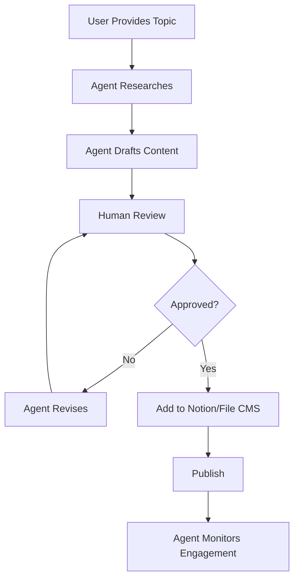
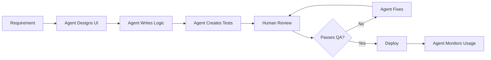
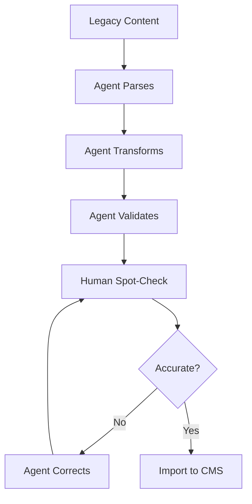

# AI Agents Integration Guide

## Overview

This document outlines the AI agent capabilities, workflows, and integration points for the Engineering Workspace platform. AI agents can assist with content creation, code generation, tool development, and user support.

---

## Table of Contents

1. [Agent Capabilities](#agent-capabilities)
2. [Agent Workflows](#agent-workflows)
3. [Integration Points](#integration-points)
4. [Agent-Assisted Tasks](#agent-assisted-tasks)
5. [Best Practices](#best-practices)
6. [Security & Ethics](#security--ethics)

---

## Agent Capabilities

### 1. Content Creation Agent

**Purpose:** Assist in creating and managing technical content

**Capabilities:**
- Generate article drafts from outlines
- Convert technical documentation to blog posts
- Create quiz questions from content
- Suggest tags and categories
- Generate meta descriptions and SEO content
- Translate content to multiple languages (future)

**Example Usage:**
```markdown
// Prompt: Create a blog post about PID controllers
Agent generates:
- Title: "Understanding PID Controllers: A Practical Guide"
- Frontmatter with appropriate tags
- Structured content with code examples
- Embedded quiz questions
- Related content suggestions
```

---

### 2. Code Generation Agent

**Purpose:** Assist in developing engineering tools and components

**Capabilities:**
- Generate React components from specifications
- Create calculator logic for engineering tools
- Write TypeScript type definitions
- Generate test cases
- Refactor existing code
- Document code with JSDoc comments

**Example Usage:**
```typescript
// Prompt: Create a voltage divider calculator component
Agent generates:
- Complete React component with TypeScript
- Input validation logic
- Calculation functions
- UI with Tailwind CSS
- Unit tests
```

---

### 3. Documentation Agent

**Purpose:** Maintain and improve project documentation

**Capabilities:**
- Generate API documentation from code
- Create README sections from features
- Update changelog from commits
- Write migration guides
- Generate inline code comments
- Create visual diagrams (Mermaid.js)

**Example Usage:**
```markdown
// Prompt: Document the Notion CMS integration
Agent generates:
- Setup instructions
- Database schema documentation
- Environment variable reference
- Troubleshooting guide
- Code examples
```

---

### 4. Testing Agent

**Purpose:** Ensure code quality and reliability

**Capabilities:**
- Generate unit tests from functions
- Create integration test scenarios
- Perform accessibility audits
- Check performance metrics
- Validate responsive design
- Security vulnerability scanning

**Example Usage:**
```typescript
// Prompt: Test the matrix calculator
Agent generates:
- Test cases for all matrix operations
- Edge case testing
- Performance benchmarks
- Accessibility test suite
```

---

### 5. User Support Agent

**Purpose:** Assist users with questions and issues

**Capabilities:**
- Answer technical questions
- Provide tool usage guidance
- Troubleshoot common issues
- Suggest relevant content
- Collect user feedback
- Escalate complex issues

**Integration:**
- Chat widget (future)
- Email support automation
- FAQ generation
- Community forum assistance

---

## Agent Workflows

### Workflow 1: Content Creation Pipeline



**Steps:**
1. User provides topic or outline
2. Agent researches related content
3. Agent drafts content with proper formatting
4. Human reviewer checks accuracy
5. Agent revises based on feedback
6. Content added to CMS
7. Published to site
8. Agent tracks engagement metrics

---

### Workflow 2: Tool Development Pipeline



**Steps:**
1. Define tool requirements
2. Agent designs user interface
3. Agent implements calculation logic
4. Agent generates test suite
5. Human QA testing
6. Agent fixes issues
7. Deploy to production
8. Monitor usage and errors

---

### Workflow 3: Content Migration Pipeline



**Use Case:** Migrating from file-based to Notion CMS or vice versa

---

## Integration Points

### 1. VS Code Integration

**Extensions:**
- GitHub Copilot for code completion
- Cursor for AI-powered editing
- Continue.dev for custom agents

**Configuration:**
```json
{
  "aiAgent.settings": {
    "defaultModel": "gpt-4",
    "contextAwareness": true,
    "autoSave": false,
    "requireReview": true
  }
}
```

---

### 2. CI/CD Integration

**GitHub Actions:**
```yaml
name: AI Code Review
on: [pull_request]

jobs:
  ai-review:
    runs-on: ubuntu-latest
    steps:
      - uses: actions/checkout@v3
      - name: AI Code Review
        uses: ai-review-action@v1
        with:
          api-key: ${{ secrets.AI_API_KEY }}
          review-style: 'detailed'
```

**Automated Checks:**
- Code quality analysis
- Security vulnerability scan
- Performance impact assessment
- Accessibility compliance

---

### 3. CMS Integration

**Notion AI Integration:**
- Auto-generate content summaries
- Suggest related databases
- Translate content properties
- Generate cover images

**Implementation:**
```typescript
// lib/ai-content.ts
export async function generateContentSummary(content: string) {
  const response = await aiClient.complete({
    prompt: `Summarize this content in 2 sentences: ${content}`,
    maxTokens: 100
  });
  return response.text;
}
```

---

### 4. Build-Time Integration

**Next.js Integration:**
```typescript
// app/api/ai-generate/route.ts
export async function POST(request: Request) {
  const { type, params } = await request.json();
  
  const result = await aiAgent.generate({
    type, // 'blog-post', 'tool', 'quiz', etc.
    params
  });
  
  return Response.json(result);
}
```

**Use Cases:**
- Generate Open Graph images
- Create sitemap entries
- Optimize images
- Generate structured data

---

## Agent-Assisted Tasks

### Task Examples by Category

#### Content Creation
- [ ] Write blog post drafts
- [ ] Generate tutorial steps
- [ ] Create quiz questions
- [ ] Write API documentation
- [ ] Generate changelog entries
- [ ] Create content translations

#### Code Development
- [ ] Generate boilerplate code
- [ ] Write utility functions
- [ ] Create React hooks
- [ ] Implement calculator logic
- [ ] Write TypeScript types
- [ ] Generate test cases

#### Design & UX
- [ ] Suggest color palettes
- [ ] Generate Tailwind classes
- [ ] Create SVG icons
- [ ] Design component layouts
- [ ] Write animation code
- [ ] Optimize for accessibility

#### Data Management
- [ ] Transform data formats
- [ ] Generate sample data
- [ ] Validate data schemas
- [ ] Create database migrations
- [ ] Generate seed data

#### DevOps
- [ ] Write deployment scripts
- [ ] Configure CI/CD pipelines
- [ ] Generate Docker configs
- [ ] Create monitoring alerts
- [ ] Document infrastructure

---

## Best Practices

### 1. Human-in-the-Loop

**Always Required:**
- Final content approval
- Technical accuracy verification
- Ethical considerations
- Brand voice alignment
- Legal compliance

**Guideline:** AI assists, humans decide

---

### 2. Quality Assurance

**Review Checklist:**
- [ ] Factual accuracy verified
- [ ] Code tested and working
- [ ] No hallucinated information
- [ ] Proper citations included
- [ ] Bias checked and minimized
- [ ] Accessibility maintained

---

### 3. Prompt Engineering

**Effective Prompts:**
```markdown
✅ Good: "Create a React component for a voltage divider calculator 
with inputs for Vin, Vout, and load current. Include validation and 
display calculated resistor values with standard value suggestions."

❌ Bad: "Make a calculator"
```

**Prompt Structure:**
1. Context/Role
2. Specific task
3. Constraints/Requirements
4. Output format
5. Examples (if helpful)

---

### 4. Version Control

**AI-Generated Code:**
- Always review before committing
- Add comment indicating AI assistance
- Include prompt in commit message
- Track which model/version was used

**Example Commit:**
```bash
git commit -m "feat: Add PID simulator tool

AI-assisted development using GPT-4
Prompt: Create PID controller simulator with interactive visualization
Reviewed-by: [Your Name]"
```

---

## Security & Ethics

### Security Considerations

**Do Not Share with AI:**
- API keys and secrets
- Personal user data
- Proprietary algorithms
- Security vulnerabilities (before fixing)
- Authentication tokens

**Implementation:**
```typescript
// Sanitize input before sending to AI
function sanitizeForAI(input: string): string {
  return input
    .replace(/API_KEY=\w+/g, 'API_KEY=[REDACTED]')
    .replace(/password=\w+/g, 'password=[REDACTED]');
}
```

---

### Ethical Guidelines

**Transparency:**
- Disclose AI assistance in content
- Label AI-generated code appropriately
- Be honest about limitations

**Bias Mitigation:**
- Review for cultural sensitivity
- Check for gender/racial bias
- Ensure inclusive language
- Verify diverse representation

**Attribution:**
- Credit original sources
- Don't claim AI work as purely human
- Acknowledge tool usage

---

### Content Authenticity

**AI Disclosure Policy:**
```markdown
This content was created with assistance from AI tools.
All technical information has been reviewed by human experts
for accuracy and completeness.
```

**Badge Component:**
```tsx
// components/ai-content-indicator.tsx
export function AIContentIndicator() {
  return (
    <div className="ai-badge">
      <SparklesIcon className="w-4 h-4" />
      <span>AI-Assisted Content</span>
    </div>
  );
}
```

---

## Future AI Integrations

### Planned Features

1. **Conversational Search**
   - Natural language queries
   - Contextual answers from content
   - Multi-turn conversations

2. **Personalized Learning Paths**
   - AI-curated content recommendations
   - Adaptive difficulty progression
   - Skill gap analysis

3. **Code Explanation**
   - Interactive code walkthroughs
   - Concept visualization
   - Practice problem generation

4. **Automated Tool Creation**
   - Describe tool in natural language
   - AI generates complete implementation
   - One-click deployment

5. **Real-time Collaboration**
   - Multi-user AI assistance
   - Shared AI context
   - Collaborative editing

---

## Agent Configuration

### Environment Variables

```env
# AI Service Configuration
AI_API_KEY=your_api_key_here
AI_MODEL=gpt-4-turbo-preview
AI_MAX_TOKENS=2048
AI_TEMPERATURE=0.7
AI_TIMEOUT=30000

# Feature Flags
AI_CONTENT_GENERATION=true
AI_CODE_REVIEW=true
AI_USER_SUPPORT=false
```

### Rate Limiting

```typescript
// lib/ai-rate-limit.ts
const rateLimit = {
  requests: 100,
  interval: 'hour',
  
  check(userId: string): boolean {
    // Implementation
  }
};
```

---

## Troubleshooting

### Common Issues

**Issue:** AI generates incorrect code
- **Solution:** Provide more specific requirements, add examples

**Issue:** Content lacks depth
- **Solution:** Request expansion on specific sections, provide outline

**Issue:** Hallucinated information
- **Solution:** Enable fact-checking mode, verify with sources

**Issue:** Inconsistent style
- **Solution:** Provide style guide, use few-shot prompting

---

## Resources

### Recommended Tools
- **GitHub Copilot** - Code completion
- **Cursor** - AI-first code editor
- **Continue.dev** - Custom AI assistants
- **Vercel AI SDK** - AI integration framework

### Learning Materials
- [Prompt Engineering Guide](https://platform.openai.com/docs/guides/prompt-engineering)
- [AI Best Practices](https://ai.google.dev/guide)
- [Responsible AI Toolkit](https://www.microsoft.com/en-us/ai/responsible-ai)

---

**Document Version:** 1.0  
**Last Updated:** 2026  
**Maintained By:** Development Team
